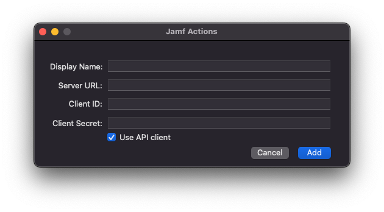
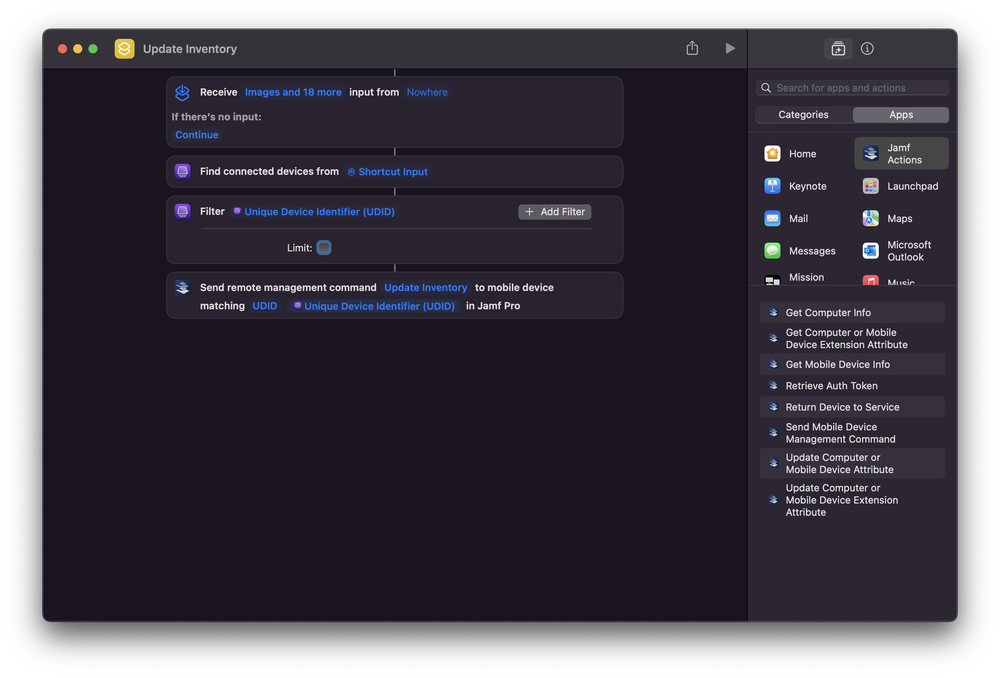

  
    

# Jamf Actions

***Easy Jamf Pro API Interactions for Apple Shortcuts for Mac***

|                  |                             |
|------------------|-----------------------------|
| Name             | Jamf Actions                |
| Solution Type    | macOS App                   |
| Download Link    | [Current Version](http://github.com/jamf-concepts/jamf-actions/releases/latest) |
| Documentation    | [Jamf Actions User Guide](https://github.com/Jamf-Concepts/actions/blob/main/Jamf%20Actions%20User%20Guide.pdf) |

## Solution Description

Eliminating technical overhead and simplifying the end user experiences, together, cuts down on time required to execute IT related tasks, decreases the number of IT tickets and most importantly, allows our end users to be more successful more efficiently. Be it a nurse that needs to quickly erase and set up a device ready for the next patient, a librarian assisting a student in checking out an iPad while ensuring that the previous student’s data is appropriately removed, or a shift worker that uses the device as a tool during their shift but making sure the device has accounts logged out and is configured for the next user, Jamf Actions can help.

Jamf Actions bridges the gap between needing to rapidly configure iOS and iPadOS devices without the end users reaching out to IT or going through a multi-step, time consuming and tedious process. Thanks to Shortcuts, plug your device(s) into a Mac with Jamf Actions and Apple Configurator, and unplug when the device is ready. Two steps, plug and unplug.

This tool allows you to make your own workflows that integrate with Shortcuts on Mac. The actions that come with Jamf Actions include:

* Retrieve information from a mobile device in Jamf Pro
* Retrieve information from a computer record in Jamf Pro
* Update information on a mobile device record in Jamf Pro
* Update information on a computer record in Jamf Pro
* Send mobile device management commands including the Return to Service workflow
* Rename and Enforce Device Name on mobile device
* (Advanced) Retrieve Auth Token for custom Shortcuts actions

## Screenshots

Configuration Screen

An Action in Apple Shortcuts

## Example Workflows

Workflow Example 1: Using Jamf Actions and Shortcuts with Apple Configurator, plugging in and unplugging devices into the Mac are triggers for automations. Offload the IT effort of erasing and provisioning devices to the end users in the field, in the school, or in the medical facility. The action of plugging in a device triggers a device wipe, automated enrollment into Jamf Pro, automated deployment of apps, configuration and wallpaper, and rapidly gets the end user device back to service.

Workflow Example 2: Checking out devices for employees or students generally takes a long time and leaves room for human error if typing is involved. Enroll the lot of devices ahead of time. When ready to assign a device to a user, input the unique identifier of the user, or use a scanner for a QR/Bar code, and let Jamf Actions inject that information into the correct device's Jamf Pro record, triggering smart group automations.

Workflow Example 3: A facility provides end users an iOS device to fill out a survey in order to check in. The facility allows the end users to use the iOS device to browse the web and use a select few apps. When the end user finishes with the device, they return it to the front desk. Instead of the front desk reaching out to IT, click the Shortcuts menu bar option to reveal a "Reset Device" button. The attendant at the front desk types in device identifier/asset tag, hits enter, and the device soft resets and sets up for the next user. Previous user data is erased but the device did not need to wipe.

## Requirements

Mac with macOS 14 Sonoma
Jamf Actions
Jamf Pro Client ID and Client Secret or Username/Password
See: Creating API Roles and Clients
Permissions will vary based on desired workflows
Apple Configurator (Required for desired workflows)
Setup Overview

Deploy/install Apple Configurator for Mac (if desired workflow requires)
Deploy/install Jamf Actions
Open Jamf Actions and fill in the following…
Display Name: A desired name to identify the server used
Server URL: Your Jamf Pro URL
example: https://yourcompany.jamfcloud.com
Client ID: The Client ID with permissions to execute desired tasks for the workflows. (or username)
Client Secret: The corresponding Client Secret for the Client ID entered. (or password)
Click “Add”. If an error occurs, verify the URL and credentials and try again
You may close Jamf Actions once a server has been added and authenticated. It does not need to be open for Shortcuts or Apple Configurator to work. Find Jamf Actions options when creating a new shortcut in Shortcuts on Mac.

## Questions and Feedback

Pleae email us at jamfactions at jamf.com

_Tags: 
Apple Shortcuts, Security Tools, Admin Tools
Jamf Actions, End User Tools, Shortcuts for Mac, Jamf Pro_

